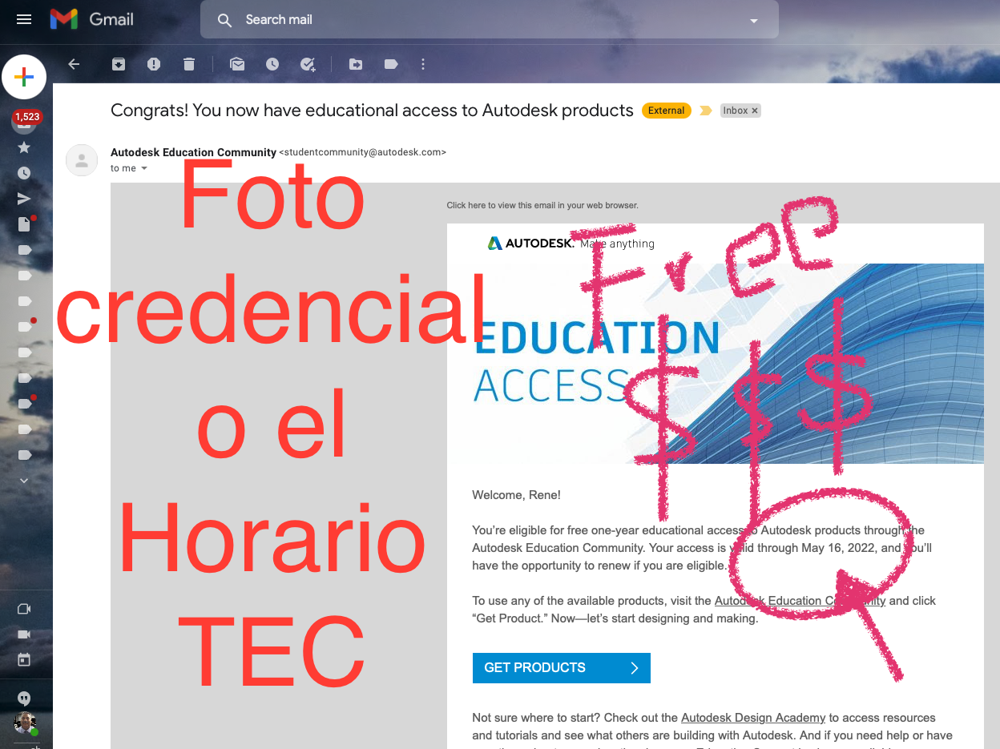
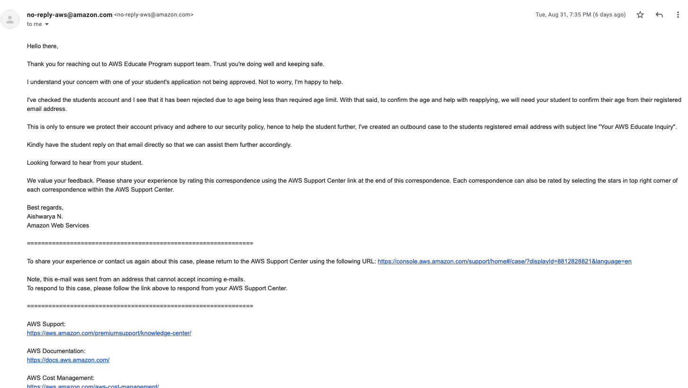

Empresa: 
  AUTODESK
  
Productos: 
  Diversos simuladores y diseños productos industriales, mucho muy conocidos aparte de ser estandarizados en el mundo
  
Requisitos: 
  Puede ser foto BIEN TOMADA de  laCredencial TEC, o Honrario oficial, lo que buscan es logo del tec, nombre de la escuela y su nombre completo tal y como lo dejaron en el formulario de la cuenta. Este pasa por un proceso automatizado si no reconoce los caracteres o patrones, son rechazados pues debe todo esta con buena calidad de imagen
  
Link: 
https://www.autodesk.com/education/edu-software/overview?sorting=featured&page=1

----

# CASOS CON LAS BECAS

## Estudiante pone mal la edad y lo determinaron como menor de edad (K12)

